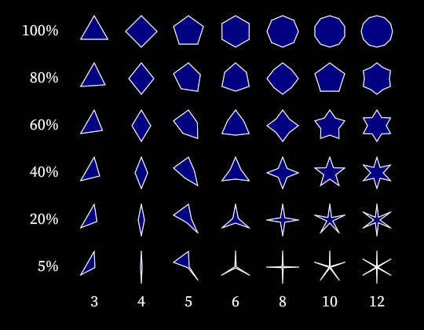

# IVG

IVG (Imperative Vector Graphics) is a compact, dependency-free 2D vector format and renderer written in C++. Graphics are described using the small imperative language **ImpD**, enabling variables and basic control flow for generative images.

The renderer relies only on the included **NuXPixels** library and provides high-quality anti-aliasing. A typical file begins with the version line:

```
format IVG-2 requires:ImpD-1
```

Instructions cover shapes, paths, images and text as well as directives for styling and transformations. See
[`IVG Documentation`](docs/IVG%20Documentation.md),
[`ImpD Documentation`](docs/ImpD%20Documentation.md) and
[`NuXPixels Documentation`](docs/NuXPixels%20Documentation.md) for the complete specification.

For integration details and API examples, see
[`Developer Guide`](docs/Developer%20Guide.md).

### Build & Test

Run `./build.sh` (or `build.cmd` on Windows) from the repository root to
compile the sample tools and execute the regression tests. The Windows
build uses the Microsoft Visual C++ compiler. `tools/BuildCpp.cmd`
automatically locates the latest installed Visual Studio via `vswhere.exe`
and falls back to versions 9.0–14.0 when `vswhere` is not available.

### Prerequisites

A standard C++ compiler such as `g++`, `clang++` or MSVC is required.
On macOS and Linux the scripts use the default compiler on your path.
On Windows MSVC must be installed.

This project is released under the [BSD 2-Clause License](LICENSE).

### Fonts

The repository includes several `.ivgfont` files converted from
Source Sans Pro, Source Serif Pro and Source Code Pro. They are
distributed under the [SIL Open Font License 1.1](https://scripts.sil.org/OFL).



### IVGFiddle

Included in this distribution is a standalone .html application called _IVGFiddle_. You can run it simply by opening the
[`ivgfiddle.html`][ivgfiddle-link] file in your favorite browser (Google Chrome). It will let you experiment with IVG code
and see the graphical output in real-time.

[ivgfiddle-link]: https://htmlpreview.github.io/?https://github.com/malstrom72/IVG/blob/main/tools/ivgfiddle/output/ivgfiddle.html

### Updating Regression Tests

The golden PNGs under `tests/png` can be regenerated using `tools/updateIVGTests.sh` or `tools\updateIVGTests.bat`. 

```bash
./tools/updateIVGTests.sh
```

### Helper Scripts

`tools/updateDocumentation.sh` rebuilds the HTML documentation using
Pandoc and [PikaScript](https://pikascript.com). `tools/updateIVGTests.sh`
reruns all IVG files in `tests/ivg` to update the reference PNGs.

## AI-Assisted Content

This project occasionally uses AI (such as OpenAI Codex) to help with writing documentation, generating code comments, producing test code, and automating repetitive edits. All of the underlying source code has been hand-written and refined over many years.
