# IVG

## Table of Contents

-	[Intro](#intro)
-	[Case conventions](#case-conventions)
-	[Rendering model](#rendering-model)
-	[Coordinate system](#coordinate-system)
-	[List grouping](#list-grouping)
-	[Error handling](#error-handling)
-	[IVG-1 vs IVG-2 vs IVG-3](#ivg-1-vs-ivg-2-vs-ivg-3)
-	[Instructions](#instructions)
	-	[ELLIPSE](#ellipse)
	-	[IMAGE](#image)
	-	[LINE](#line)
	-	[PATH](#path)
	-	[POLYGON](#polygon)
	-	[RECT](#rect)
	-	[STAR](#star)
	-	[TEXT](#text)
	-	[WIPE](#wipe)
-	[Directives](#directives)
	-	[bounds](#bounds)
	-	[context](#context)
	-	[define](#define)
	-	[fill](#fill)
	-	[font](#font)
	-	[mask](#mask)
	-	[options](#options)
	-	[pen](#pen)
	-	[reset](#reset)
-	[Specifications](#specifications)
	-	[Color Specification](#color-specification)
	-	[Gradient Specification](#gradient-specification)
	-	[Paint Specification](#paint-specification)
	-	[Transform Specification](#transform-specification)
-	[Defaults](#defaults)

## Intro

_IVG_ (_Imperative Vector Graphics_) is a compact, easy-to-read 2D vector graphics format and rendering engine built on
top of a simple imperative language called _ImpD_. It allows the creation of generative graphics that can adapt to input
parameters rather than just describing static images.

_IVG_ is easy to integrate into existing C++ projects and has no dependencies on other libraries or operating system
function calls. It uses a low-level 2D rendering C++ library called _NuXPixels_ (included in the distribution), which is
light on the CPU and provides high-quality anti-aliasing.

This document describes the **IVG-3** format. Legacy IVG-1/IVG-2 syntax is considered deprecated.

In _IVG_, the graphics are described using a set of drawing instructions, which are interpreted by _ImpD_ and then sent
to the _NuXPixels_ engine to produce the final pixel raster. These instructions include basic shapes like rectangles,
ellipses, and stars and more advanced options like paths, images, and text. Additionally, the _IVG_ format includes
options for styling and transforming the graphics, such as setting colors, gradients, and patterns for fills and
strokes, as well as applying transformations like scaling, rotating, and skewing.

To give you a better idea of how _IVG_ works, here's an example of a simple source code that creates a smiley face:

	// IVG and ImpD version.
	format IVG-3 requires:ImpD-1
	
	// Set the canvas bounds to 400x400 pixels.
	bounds 0,0,400,400
	
	// Wipe the canvas with a deep red fill.
	WIPE maroon
	
	// Set the fill color to yellow.
	fill yellow
	
	// Draw the face.
	ELLIPSE 200,200,150
	
	// Set the fill color to black.
	fill black
	
	// Draw the eyes.
	ELLIPSE 150,170,25
	ELLIPSE 250,170,25
	
	// Draw the mouth using a path instruction list.
	PATH [move-to 150,270; bezier-to 200,320,250,270]
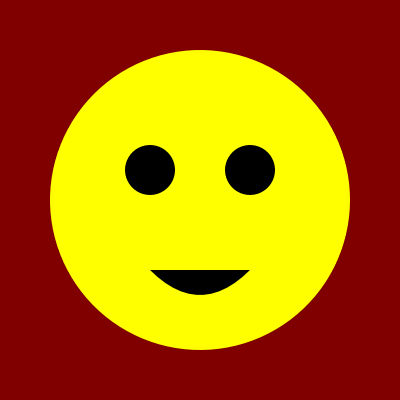

This is just a simple example, but it demonstrates the basic structure and syntax of an _IVG_ document. As you continue
reading the documentation, you will learn about all the different instructions and options available in _IVG_ and how to
use them to create your vector graphics.

It's worth noting that basic knowledge of the _ImpD_ language is necessary to understand and use the _IVG_ format fully.
For more information on _ImpD_, please refer to the separate [_ImpD documentation_](ImpD%20Documentation.md) provided.
It will cover how to use variables and control flow statements to create dynamic and interactive graphics.

The _IVG_ format used in this documentation is `IVG-3`. Therefore, the `format` instruction should be as follows:

	format IVG-3 requires:ImpD-1

## Case conventions

_ImpD_ is case-insensitive, but this documentation follows a convention: "directives" (defining settings, etc.) are
written in lowercase and drawing instructions in uppercase. Segment commands inside `PATH` compounds, such as `move-to`
and `line-to`, also appear in lowercase. In short, any instruction in uppercase produces visible output, while
lowercase forms configure state or describe geometry for later use. In all examples, drawing instructions appear in
UPPERCASE.

## Rendering model

Later drawing instructions paint over earlier ones. Compositing uses Porter–Duff _source-over_ on premultiplied color.
Any `opacity` modifier multiplies the alpha channel of its paint.

## Coordinate system

All coordinates are measured in pixels. The origin is at the top-left corner, _x_ increases to the right, _y_ increases
downward, and fractional coordinates are allowed.

Angle conventions: Angles are in degrees, 0° at the positive x‑axis, clockwise is positive.

## List grouping

In ImpD, you normally separate list values with commas:

	LINE 30,40,140,70,200,120,260,150,310,170

If you enclose a list in square brackets `[ ... ]`, commas may be omitted and spaces can act as separators. This is
convenient for long coordinate lists:

	LINE [30,40 140,70 200,120 260,150 310,170]

The two forms are equivalent. Bracketed lists are often easier to read for geometry with many points.

## Error handling

Malformed input, such as unknown directives, incorrect argument counts or out-of-range values, triggers a run-time error
and halts rendering.

## IVG-1 vs IVG-2 vs IVG-3

-	`IVG-1` covers core vector drawing and styling.
-	`IVG-2` adds text, fonts, and raster image support through `define image` and `IMAGE`.
-	`IVG-3` adds `LINE`, `POLYGON`, and an instruction-list form for `PATH` (including `define path`).

The interpreter processes all versions identically, but readers that only understand `IVG-1` or `IVG-2` will reject
documents marked `IVG-3`.

## Instructions

### ELLIPSE

The `ELLIPSE` instruction draws an ellipse or circle shape on the canvas. It will be filled with the current
[`fill`](#fill) setting and outlined with the current [`pen`](#pen) setting.

Syntax:

	ELLIPSE <cx>,<cy>,<r>[,<ry>=<r>] [ sweep:<start>,<degrees> [ type:(pie|chord)=chord ] ]

-	`<cx>,<cy>` is the center point of the ellipse.

-	`<r>[,<ry>=<r>]` is the radius of the ellipse. If you only provide one value, it will be used for both axes,
	creating a circle.
	
-	With `sweep`, draws a closed partial ellipse sector. `<start>` and `<degrees>` follow the angle conventions (0° at the positive x‑axis, clockwise is positive).
	
-	`type` is either `chord` or `pie`:
	-	`chord` closes the arc with a straight line between arc endpoints (default).
	-	`pie` closes the arc with two radii from the center to the endpoints.

Example:

	bounds 0,0,300,200
	
	// Wipe the canvas with near-white.
	WIPE #E0E0E0
	
	// Fill a red circle.
	fill #802020
	ELLIPSE 150,100,80

	// Outline a flat ellipse, rotated 10 degrees clockwise around its center.
	fill none
	pen #802020 width:5
	rotate 10 anchor:150,100
	ELLIPSE 150,100,140,30
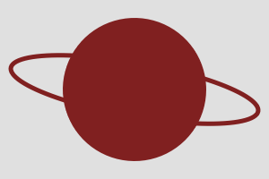

Pac‑Man (sector using `type:pie`):

	bounds 0,0,200,200
	fill yellow
	pen black width:2
	ELLIPSE 100,100,80 sweep:30,300 type:pie
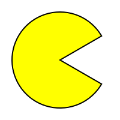

### IMAGE

You use the `IMAGE` instruction for drawing an image on the canvas. The image can be a previously defined image created
with the [`define image`](#define-image) directive or an external resource specified by its name or file path.

Syntax:

	IMAGE <x>,<y> <name>
		  [ align:top|middle|bottom left|center|right="top left" ]
		  [ clip:<x>,<y>,<w>,<h> ]
		  [ width:<width> ]
		  [ height:<height> ]
		  [ stretch:(yes|no)=yes ]
		  [ transform:<transform> ]
		  [ opacity:<opacity> ]

-	The `<x>,<y>` coordinates specify the position of the image. By default, the image's top-left corner is placed on
	these coordinates, but you can choose the alignment with the 'align' option.

-	`<name>` is the name of the image, either defined with [`define image`](#define-image) or an external resource name
	or path.

-	The `align` option specifies the image's alignment on the canvas. The default value is `top left`.

-	The `clip` option is used to define a clipping rectangle in source image coordinates to limit the area of the image
	that will be drawn.

-	The `width` and `height` options fit the source image into a specific width and height.

-	If `stretch` is `no` and `width` and/or `height` is supplied, the source image preserves its aspect ratio and fits
	within those dimensions. Otherwise, it stretches the image to fill the specified `width` and/or `height` exactly.

-	The `transform` option is used to apply a transformation to the image when it is drawn. See [Transform
	Specification](#transform-specification)

-	The `opacity` option is used to set the image's opacity. A value of 1 (or `#FF`) is fully opaque, and 0 is fully
	transparent.

`IMAGE` uses _bilinear interpolation_ on premultiplied linear RGBA values when executing all transformations. Images are
expected to be premultiplied, and no resampling-quality option is available, so large rescales may result in low image
quality.

Demonstration:

	format IVG-3 requires:ImpD-1
	bounds 0,0,340,300
	options aa-gamma:1.5
	
	// Fill the canvas with a "barber pole" pattern
	WIPE pattern:[bounds 0,0,40,300; WIPE gradient:[linear 0,0,40,0 stops:[
		0,gray,0.25,blue,0.5,gray,0.75,maroon,1,gray
	] ] ] transform:[rotate 45]
	
	// Define an image called "silly"
	define image silly [
		bounds 0,0,100,100
		pen white; RECT 0.5,0.5,99,99
		fill aqua; pen black; ELLIPSE 50,50,35,45
		fill white; pen black; ELLIPSE 37,40,10; ELLIPSE 62,45,10
		fill black; ELLIPSE 39,42,4; ELLIPSE 60,42,4
		fill red; PATH svg:[M 27,65 Q 70,85 72,60 z]
	]
	
	font serif size:20 color:silver outline:black
	fill red opacity:#60
	pen red width:1
	
	// A: standard
	IMAGE 10,10 silly
	STAR 10,10,4,5
	TEXT at:60,130 anchor:center A
	
	// B: showcasing alignment and transform
	IMAGE 170,70 silly align:[middle center] transform:[scale 0.7;rotate -20]
	STAR 170,70,4,5
	TEXT at:170,130 anchor:center B
	
	// C: showcasing clipping and opacity
	IMAGE 230,10 silly clip:[25,25,50,50] opacity:0.6
	STAR 230,10,4,5
	TEXT at:280,130 anchor:center C
	
	// D: showcasing clipping and scale to exact width
	IMAGE 10,160 silly align:[top left] clip:[25,25,50,50] width:100 stretch:no
	STAR 10,160,4,5
	TEXT at:60,280 anchor:center D
	
	// E: showcasing a different aspect ratio 
	IMAGE 220,260 silly align:[bottom right] width:100 height:66
	STAR 220,260,4,5
	TEXT at:170,280 anchor:center E
	
	// F: showcasing vertical flipping with transform
	IMAGE 230,160 silly align:[bottom right] transform:[scale -1]
	STAR 230,160,4,5
	TEXT at:280,280 anchor:center F
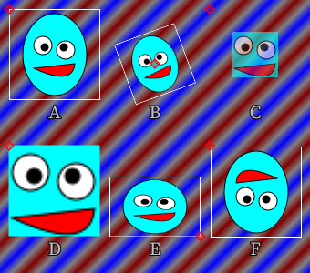

### LINE

The `LINE` instruction draws an open polyline using the current [`pen`](#pen).

Syntax:

	LINE <x0>,<y0>,<x1>,<y1>[,<x2>,<y2> ...]

At least two points (four coordinates) are required. Two points draw a single line segment; additional points extend the
polyline.

Example:

	format IVG-3 requires:ImpD-1
	bounds 0,0,340,220
	WIPE #0b1020
	fill none
	pen #8fd3ff width:6 caps:round
	LINE [30,40 140,70 200,120 260,150 310,170]
	fill #ffd35a
	pen none
	ELLIPSE 310,170,8
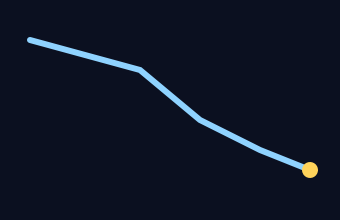

### PATH

The `PATH` instruction draws an arbitrary vector path. It will be filled with the current [`fill`](#fill) setting and
outlined with the current [`pen`](#pen) setting. Paths may be supplied as an instruction list, raw SVG data, or by
referencing a previously defined path name.

Syntax:

	PATH (<instructions> | svg:<svg data> | <name>) [transform:<transform>]

- `<instructions>` is a bracketed list of sub-commands (either separated by new lines or semicolons). See below.

- `<svg data>` is a string containing SVG path data. See https://svgwg.org/specs/paths/ for details.

- `<name>` is a path defined with [`define path`](#define-path).

- The `transform` option applies a transformation before drawing, using the same syntax as [`IMAGE`](#image).

_The `PATH svg:` form is available in all IVG versions. The instruction-list variant requires IVG-3._

#### Path Instructions

Within `PATH [ ... ]`, commas may be omitted between coordinate pairs.

- `move-to <x>,<y>` sets the starting point for a new sub-path.
- `move-angle <angle>,<length>` moves the current point by `<length>` at `<angle>` (0° is the positive x-axis; angles increase clockwise).
- `line-to <x>,<y>[,<x>,<y>,...]` draws one or more line segments from the current point.
- `line-angle <angle>,<length>` draws a line of length `<length>` from the current point at `<angle>`.
- `bezier-to <cx>,<cy>,<x>,<y>` draws a quadratic Bézier curve.
- `bezier-to <c1x>,<c1y>,<c2x>,<c2y>,<x>,<y>` draws a cubic Bézier curve.
- `arc-to <x>,<y>,<r>[,<ry>=<r>] [turn:(cw|ccw)=cw] [large:yes|no=no] [rotate:<deg>=0]` draws an elliptical arc.
- `arc-sweep <cx>,<cy>,<degrees>` draws an arc around a center point, sweeping by the given angle (positive is clockwise).
- `arc-move <cx>,<cy>,<degrees>` moves the current point along an arc sweep without drawing.
- `close` closes the current sub-path by drawing a line back to its starting point. (No effect if already closed.)

#### Coordinate System and State

- `anchor [<x>,<y>]` sets a new local origin (translation only) for subsequent `PATH` coordinates. Uses the current point if no arguments are supplied, otherwise the coordinates are interpreted as global (unrelated to any previous `anchor` calls).
- `cursor [<var>] [x:<var>] [y:<var>]` stores the global cursor position (indifferent to any previous `anchor` calls). At least one target must be provided.

#### Sub-path Commands

These commands mirror their drawing-instruction counterparts but only append path geometry (they don’t paint by themselves):

- `ellipse <cx>,<cy>,<r>[,<ry>=<r>] [ sweep:<start>,<degrees> [ type:(pie|chord)=chord ] ]` appends a full ellipse or a closed sector.
- `line <x0>,<y0>,<x1>,<y1>[,<x2>,<y2> ...]` appends an open polyline starting at `<x0>,<y0>`.
- `path <name> | svg:<data> | [<instructions>] [transform:<transform>]` splices another path’s geometry into the current `PATH`. If the spliced path doesn’t begin with move-to, its first segment continues from the current point
- `polygon <x0>,<y0> <x1>,<y1> [<x2>,<y2> ...]` appends a closed polygon.
- `rect <x>,<y>,<w>,<h> [rounded:<r>|<rx>,<ry>]` appends an axis-aligned rectangle.
- `star <cx>,<cy>,<points>,<r1>[,<r2>=<r1>] [rotation:<angle>]` appends a star or regular polygon.
- `text [at:<x,y>] [anchor:left|center|right=left] <text>` appends a text outline.

#### Examples

Quadratic and cubic Bézier curves:

	format IVG-3 requires:ImpD-1
	bounds 0,0,340,260
	WIPE #0e1726

	// Curvy string with quadratic and cubic Beziers
	fill none
	pen #7dd3fc width:4 caps:round
	PATH [
		move-to 50,220
		bezier-to 140,160,200,200
		bezier-to 220,200,240,120,280,220
	]

	// Heart balloon using cubic Beziers
	fill #ff6fae; pen #555555 width:2
		PATH [
			move-to 170,80
			bezier-to 170,60,210,60,210,80
			bezier-to 210,110,170,130,170,150
			bezier-to 170,130,130,110,130,80
			bezier-to 130,60,170,60,170,80
			close
		]
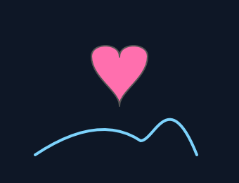

Arcs:

	format IVG-3 requires:ImpD-1
	bounds 0,0,340,200
	WIPE #101418
	fill none
	pen #2ee6a6 width:10 caps:round
	
	// open arcs (drawn)
	PATH [ move-to 60,120;	arc-sweep 170,120,180 ]
	PATH [ move-to 60,120;	arc-sweep 170,120,140 ]
	pen #ff6fae width:3
	
	// a face for fun
	fill #ffd45a; pen #222222 width:2
	ELLIPSE 170,120,60
	fill #222222; pen none
	ELLIPSE 150,105,6; ELLIPSE 190,105,6
	pen #222222 width:3; fill none
	PATH [ move-to 145,135; arc-sweep 170,125,-90 ]

Using raw SVG data:

	format IVG-3 requires:ImpD-1
	bounds 0,0,400,380

	// Wipe the canvas with a very dark purple
	WIPE rgb(0.1,0.0,0.1)

	// Pink fill and red transparent outline
	fill rgb(0.9,0.5,0.7)
	pen rgb(0.5,0.2,0.2,0.5) width:20

	// Rotate the canvas
	rotate -135 anchor:200,200

	// Draw the heart path
	PATH svg:[M100,300 v-200 h200 a100,100,90,0,1,0,200 a100,100,90,0,1,-200,0 z]
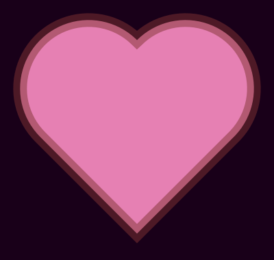

### POLYGON

The `POLYGON` instruction draws a closed polygon using the current [`fill`](#fill) and [`pen`](#pen).

Syntax:

	POLYGON <x0>,<y0>,<x1>,<y1>[,<x2>,<y2> ...]

At least three points (six coordinates) are required. The polygon is automatically closed.

Example:

	format IVG-3 requires:ImpD-1
	bounds 0,0,340,260
	WIPE #e6f7ff
	
	// kite body
	fill #ffb703
	pen #0f172a width:2
	POLYGON [170,30 230,90 170,210 110,90]
	
	// cross spars
	pen #0f172a width:3; fill none
	LINE 170,30,170,210
	LINE 110,90,230,90
	
	// tail
	pen #0f172a width:2
	LINE [170,210 150,235 125,220 110,245]
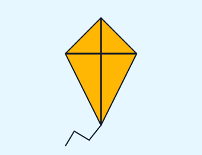

### RECT

You use the `RECT` instruction to draw a rectangle shape. It will be filled with the current [`fill`](#fill) setting and
outlined with the current [`pen`](#pen) setting.

Syntax:

	RECT <x>,<y>,<w>,<h> [rounded:<r>|<rx>,<ry>]

-	`<x>,<y>,<w>,<h>` is a rectangle specification in the format of x,y,w,h.

-	The `rounded` option specifies the radius of the rounded corners. You specify the radius as a single value for all
	corners or as separate values for the x and y radius.

Example:

	format IVG-3 requires:ImpD-1
	bounds 0,0,300,80
	
	// Draw a dark blue rectangle.
	fill #406080
	RECT 60,10,180,60
	
	// Draw a brighter rounded rectangle on top with a white outline.
	fill #80C0E0
	pen #C0E0E0
	RECT 80,20,140,40 rounded:30,20
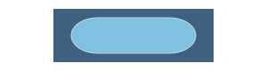

### STAR

The `STAR` instruction is used for drawing a star shape or regular polygon. It will be filled with the current
[`fill`](#fill) setting and outlined with the current [`pen`](#pen) setting.

Syntax:

	STAR <cx>,<cy>,<points>,<r1>[,<r2>=<r1>] [rotation:<angle>]

All numeric parameters are supplied in one comma-separated list.

-	`<cx>, <cy>` are the x and y coordinates of the center of the star.

-	`<points>` is the number of points of the star.

-	`<r1>[,<r2>=<r1>]` are the inner and outer radius of the star. If `<r2>` is omitted, `<r1>` is used for both,
	creating a regular polygon.

-	The `rotation` option specifies the angle of rotation for the star in degrees.

This example shows the effect of varying the number of points and the proportion of `<r2>` to `<r1>`:

	format IVG-3 requires:ImpD-1
	bounds 0,0,540,420
	options aa-gamma:1.5
	
	// Black canvas, white pen and maroon fill.
	WIPE black
	pen white
	fill navy
	
	// White serif font face, size 20.
	font serif size:20 color:white
	
	// Setup a list of star point counts.
	counts = [3,4,5,6,8,10,12]
	
	// Loop through a list of <r2> to <r1> proportions.
	offset 60,0
	for r2 in:[100,80,60,40,20,5] [
		context [
			// Draw a label indicating the proportion on this row.
			TEXT at:15,45 $r2% anchor:right
	
			// Loop through the list of star point counts.
			for c in:$counts [
				// Offset 60 pixels to the right on each iteration.
				offset 60,0
	
				// Draw a star with the current point count and radius values.
				STAR 0,40,$c,20,{20*$r2%}
			]
		]
	
		// Offset 60 pixels down on each iteration
		offset 0,60
	]
	
	// Loop through the list of star point counts.
	for c in:[3,4,5,6,8,10,12] [
		// Offset 60 pixels to the right on each iteration
		offset 60,0
	
		// Draw a label indicating the point count for this column.
		TEXT at:0,30 $c anchor:center
	]

### TEXT

You use the `TEXT` instruction for drawing text on the canvas. It uses the current font settings for its text style.

Syntax:

	TEXT [at:<x,y>] [anchor:left|center|right=left] [caret:<variable>] <text>

-	The `at` option specifies the x,y coordinates of the text. If not present, the text will continue to the right of
	the last written string.

-	The `anchor` option specifies the horizontal alignment of the text. The default value is `left`, and anything else
	requires the `at` argument.

-	The `caret` option specifies a variable that will be set to the final horizontal caret position, i.e., the position
	where the next character would have been written.

-	`<text>` is the text to be drawn on the canvas. `TEXT` draws a single line of text only.

The `y` coordinate specifies the baseline of the text. Font ascent and descent come from the font definition, and `size`
maps one _em_ to that many pixels. The `anchor` option only adjusts horizontal alignment; vertical placement always
uses the baseline.

Demonstration:

	format IVG-3 requires:ImpD-1
	options aa-gamma:1.5
	
	bounds 0,0,440,80
	WIPE hsv(0.5,0.8,0.1)
	
	// Setup parameters for drawing the text.
	s="Lorem Ipsum Dolor Sit Amet"
	size=24
	x=220
	y=45
	margin=15
	
	/*
		The shear transformation creates a slant, and the tracking value increases the space
		between letters. IVG in itself has no built-in fonts, but "serif", "sans-serif" and
		"code" are used when creating this documentation (and they are included in ivgfiddle).
	*/
	font serif size:$size color:hsv(0.47,0.3,0.9) outline:black
		.. transform:[shear -0.3,0] tracking:0.1
	
	/*
		To measure the text, draw it centered around position, store the final x position in
		the variable `rx`
	*/
	TEXT at:$x,$y $s anchor:center caret:rx
	
	// Setup fill and pen gradients for the box.
	fill gradient:[linear 0,18,0,40 from:hsv(0.5,0.5,0.2) to:hsv(0.5,0.7,0.6)]
	pen gradient:[radial $x,{$y-$size/3},{$rx-$x},$size from:hsv(0.4,0.7,0.9) to:hsv(0.5,0.7,0.4)] width:8.0
	
	/*
		Draw a rounded rect box around the text. The equations make the box dimensions adjust
		to the text width and height.
	*/
	RECT {$x*2-$rx-$margin},{$y-$size*1.2},{$rx*2-$x*2+$margin*2},{$size*1.8}
		.. rounded:{$size*1.8/2}
	
	// Draw the final text.
	TEXT at:$x,$y $s anchor:center
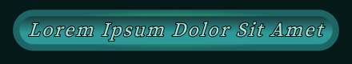

### WIPE

The `WIPE` instruction is used for painting over the entire canvas, except for any masked areas.

Syntax:

	WIPE <paint>

-	`<paint>` is the paint used for the wipe. You specify it as a color, gradient, or pattern. See
	[Paint Specification](#paint-specification) for more information. Note that _relative paint_ is not allowed for this
	instruction.

Example:

	format IVG-3 requires:ImpD-1
	bounds 0,0,200,200
	
	// Wipe the full canvas with a radial rainbow gradient
	WIPE gradient:[
	radial 100,100,100
	stops:[0,red,0.25,yellow,0.5,lime,0.75,aqua,1,blue]
	]
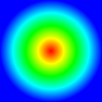

## Directives

### bounds

The `bounds` directive declares the outer boundaries of a _standalone_ canvas:

	bounds <x>,<y>,<w>,<h>

You should only use it once at the top level of the document and once in each pattern and image definition. You must
declare it before the first drawing instruction. You may omit this directive if the canvas is not _standalone_ but part
of a shared drawing area.

Example:

	// Declare a 400 pixels wide and 300 pixels high canvas. The top-left corner is (10,50).
	bounds 10,50,400,300

### context

`context` declares a local group where all modified properties, masks, transforms, and definitions are restored when the
group ends.

	context <instructions>

Demonstration:

	format IVG-3 requires:ImpD-1
	bounds 0,0,300,300
	
	// Wipe the canvas with a gradient, to begin with.
	WIPE gradient:[linear 0,0,200,200 from:black to:gray]
	
	// Setup fill, pen, and an initial transform of x2.
	pen black width:3
	fill none
	
	// Draw a small rect.
	RECT 75,75,150,150
	context [
		// rotate
		rotate 10 anchor:150,150
		
		// The fill and pen will be local to this context.
		fill gradient:[linear 0,0,1,0 from:silver to:blue] relative:yes
		pen none
		
		// Fill a rotated, masked gradient 3d cube silhouette.
		STAR 150,150,6,90,110
	]
	// This rect will have the same style and transformation as the first.
	RECT 60,60,180,180
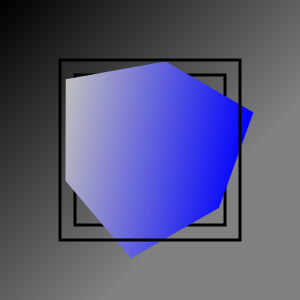

### define

The `define` directive is used to create reusable elements in the document, such as images and fonts. These elements can
be referred to by name in other document parts.

#### define image

You use the `define image` directive to create an image you can reuse throughout the document with the [`IMAGE`](#image)
instruction.

Syntax:

	define image <name> [ resolution:<number>=1 ] <instructions>

-	`<name>` is a unique identifier for the image. Image names are case-sensitive, and you may only define the image
	once.

-	The `resolution` option specifies the resolution factor to use when creating the image. The default value is 1,
	which corresponds to the normal resolution. A value of 2, for example, would use twice the resolution when creating
	the image.

-	`<instructions>` are the graphic instructions that define the image, enclosed in brackets `[` and `]`. The drawing
	context for the image contents does not inherit settings from the current context. A `bounds` directive is required.

When you create an image using the `define image` directive, it will be converted into pixels at the time of definition.
It's important to use a resolution matching the size you plan to use for displaying the image.

See [IMAGE](#image) for an example of how to use `define image`.

#### define font

You can use the `define font` directive to create and embed a font face within the _IVG_ document. The font is defined
using [_ivgfont_](ivgfont%20Documentation.md), a format describing glyphs using SVG paths. Like _IVG_, _ivgfont_ is also
based on _ImpD_.

Syntax:

	define font <name> <definition>

-	`<name>` is a unique identifier for the font face. Font names are case-sensitive, and you may only define the font
	once.

-	`<definition>` is the font face definition in _ivgfont_ format, enclosed in brackets `[` and `]`.

It's worth noting that the `define font` directive is not necessary for referencing fonts provided by the hosting
application, as they can be referred to by name and set with the [`font`](#font) directive, just like embedded fonts.

Example:

	format IVG-3 requires:ImpD-1
	
	// Embed a font called "myEmbeddedFont" with only 3 defined glyphs.
	define font myEmbeddedFont [
		format ivgfont-1 requires:ImpD-1
		metrics upm:1000 ascent:1036 descent:-335 linegap:0
	
		glyph I 371 m136-617-92-11v-41h283v41l-92,11-2,128v308l2,129,92,11V0H44v-41l92-11q2-63,2-128v-308q0-65-2-129z
		glyph V 674 m90-619-75-9v-41h273v45l-96,9,168,479,162-478-88-10v-45h231v41l-87,12L367,7h-44L90-619z
		glyph G 682 m384,15q-100,0-176-45-76-46-119-125-42-79-42-180t43-179q43-79,119-124,77-46,179-46,62,0,110,12,49,11,91,35l4,146h-62l-20-114q-52-29-114-29-69,0-124,35-54,35-86,102-31,66-31,162,0,143,66,221t181,78q57,0,107-20v-32l-1-90-1-91-104-9v-40h263v40l-61,6-2,91v137Q552-17,499-1T384,15z
	
		// Adjust kerning between V and G with -70.
		kern -70 V G
	]
	
	// Show it off.
	bounds 0,0,265,160
	WIPE yellow
	font myEmbeddedFont size:100 color:red outline:[black width:5] tracking:0.1
	TEXT at:40,110 "IVG"
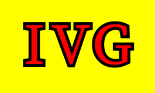

#### define path

You can define a reusable path and draw it later with the [`PATH`](#path) instruction.

Syntax:

	define path <name> <path-definition>

-	`<name>` is a unique identifier for the path. Path names are case-sensitive and may only be defined once.

-	`<path-definition>` follows the same syntax as [`PATH`](#path), using either `svg:` data or path instructions
	inside brackets.

Example:

	define path star [svg:[M0,0 L10,0 L5,8 z]]
	fill gold
	PATH star transform:[rotate 45]

### fill

The fill directive sets the fill style for subsequent drawing operations in the current [context](#context).

	fill <paint>
		[ rule:(non-zero|even-odd)=non-zero]

-	`<paint>` sets the color, gradient, or pattern. See [Paint Specification](#paint-specification) for more
	information.

-	The `rule` option sets the rule used to determine which regions of the path will be filled. The possible values are
	`non-zero` (for the _non-zero winding rule_) and `even-odd`. See https://en.wikipedia.org/wiki/Nonzero-rule and
	https://en.wikipedia.org/wiki/Even-odd_rule. The default value is `non-zero`.

Fill rule demonstration:

	format IVG-3 requires:ImpD-1
	bounds 0,0,350,230
	
	// Setup style.
	WIPE silver
	fill white
	pen black width:3
	font serif size:30 color:black
	
	/*
		Showing non-zero winding fill rule. The two triangles making up
		the star are both winding clockwise so the overlap will be filled.
	*/
	context [
		offset 100,100
		scale 0.75
		fill rule:non-zero
		PATH svg:[M 0 -100 87 50 -87 50 z M 87 -50 0 100 -87 -50 z]
		TEXT at:0,135 anchor:center "non-zero"
	]
	
	// Showing even-odd fill rule. Overlap will be unfilled.
	context [
		offset 250,100
		scale 0.75
		fill rule:even-odd
		PATH svg:[M 0 -100 87 50 -87 50 z M 87 -50 0 100 -87 -50 z]
		TEXT at:0,135 anchor:center "even-odd"
	]
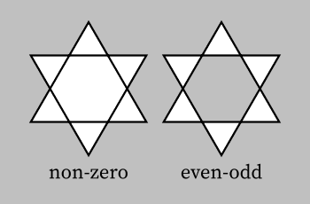

### font

The `font` directive updates font settings for the current context. The settings will be used for subsequent text
drawing operations and will be active until they are changed or the current [context](#context) ends or is
[reset](#reset).

Syntax:

	font [ <name> ]
		 [ size:<number> ]
		 [ color:<paint> ]
		 [ outline:<stroke> ]
		 [ transform:<transform> ]
		 [ tracking:<number> ]

-	`<name>` is the name of the font face to be used. Before drawing text, you are required to set the font name. It can
	be a font previously defined using the [`define font`](#define-font) directive or a font provided by the hosting
	application. If not specified, the font face will not be changed.

-	`size` sets the font size in pixels. One "unit" in the font definition corresponds to this many pixels in size. This
	value usually corresponds to the font height (it's "ascent"). The initial setting is 20.

-	`color` sets the color of the text. The initial setting is `black`. See [Paint Specification](#paint-specification)
	for more information.

-	`outline` sets the outline of the text. It accepts the same arguments as the [`pen`](#pen) directive. Note that the
	outline will be drawn under the fill color, which is the opposite behavior of other shapes. Also, the stroke width
	is twice the regular width because normally, you only see half the stroke (the outer part that is not overdrawn by
	the glyph's interior).

-	`transform` will transform each glyph separately. You express offsets in (size-independent) _em units_.

-	`tracking` adjusts letter spacing in (size-independent) _em units_ (0 is no adjustment).

See [TEXT](#text) for an example of how to set the font.

### mask

The `mask` instruction is used to create a mask that will be applied to subsequent drawing operations. You define the
mask with a set of instructions that draws the mask. The effect of the mask lasts until the end of the current
[context](#context) or until it is [reset](#reset).

Syntax:

	mask <instructions> [ inverted:(yes|no)=no ]

-	`<instructions>` defines the mask. You can use all available drawing directives and instructions. Enclose in
	brackets `[` and `]`.

-	The `inverted` option specifies whether you want to invert the mask or not (default is `no`). When the mask is not
	inverted, it will reveal all painted areas and hide everything else. On the other hand, if the mask is inverted, it
	will hide all painted areas and reveal everything else.

In mask definitions, drawing directives and instructions work like normal, and you can even nest masks in masks. The one
big difference is that a mask is single-channeled (grayscale effectively); therefore, all `<paint>` specifications use a
single value between 0 and 1. Alternatively, you can use a hexadecimal value between `#00` to `#FF`.

A color value of 1 or `#FF` represents the fully opaque color, meaning that (in non-inverted mode) areas painted with
this color will be fully visible, while lower values will result in more transparency.

Initially, the pen (and font outline) is set to `none`, and the fill (and font color) to `#FF` (fully opaque).

Mask operations multiply with any existing mask. Mask paints honor `opacity` and gradients, and colors are treated as
single-channel coverage values.

Demonstration:

	format IVG-3 requires:ImpD-1
	bounds 0,0,310,320
	
	// Make a rotated striped background.
	WIPE pattern:[
		bounds 0,0,20,20
		WIPE #101010
		fill #202020
		RECT 0,0,10,20
	] transform:[rotate 45]
	
	// Setup styles.
	fill red
	font serif size:18 color:yellow
	
	// Define two circles.
	c1=70,70,50
	c2=110,70,30
	
	// A macro to outline them.
	outline=context [
		fill none
		pen silver width:0.5 dash:4
		ELLIPSE $c2
		ELLIPSE $c1
	]
	
	// A: no masking. Draw only circle 1.
	ELLIPSE $c1
	$outline
	TEXT at:70,145 anchor:center "A"
	
	// B: mask circle 1 to include only circle 2.
	offset 150,0
	context [
		mask [
			ELLIPSE $c2
		]
		ELLIPSE $c1
	]
	$outline
	TEXT at:70,145 anchor:center "B"
	
	// C: mask circle 1 to exclude circle 2.
	offset -150,150
	context [
		mask [
			ELLIPSE $c2
		] inverted:yes
		ELLIPSE $c1
	]
	$outline
	TEXT at:70,145 anchor:center "C"
	
	// D: masks can also be semi-transparent.
	offset 150,0
	context [
		mask [
			fill gradient:[linear 0,0,0.5,1 from:#00 to:#C0] relative:yes
			ELLIPSE $c2
		]
		ELLIPSE $c1
	]
	$outline
	TEXT at:70,145 anchor:center "D"
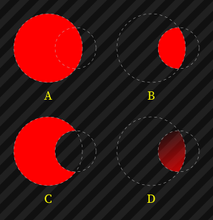

### options

`options` is a directive that allows fine-tuning quality settings for the subsequent instructions. Settings are local to
the current [context](#context).

	options [ aa-gamma:<number> ]
			[ curve-quality:<number> ]
			[ pattern-resolution:<number> ]

-	`aa-gamma` allows adjusting gamma correction applied to the edges of strokes and fills to improve anti-aliasing
	quality. Note that the best quality gamma setting depends on your mixing colors. Settings higher than 1 usually make
	light strokes on dark backgrounds look better, and settings lower than 1 can make drawing dark on light look better.
	The initial value is 1, and the valid range is any number greater than 0.

-	`curve-quality` controls the quality when converting strokes, ellipses, arcs, and splines to polygons. The standard
	value is 1, and the valid range is between 0 and 100.

-	`pattern-resolution` changes the resolution used when creating patterns. A value of 1 uses standard resolution, 2
	uses twice the resolution, and so on. Notice that the effective pixel resolution is chosen with a formula that
	considers the current context transform, and the resolution is always an integer factor.

`aa-gamma` demonstration:

	format IVG-3 requires:ImpD-1
	bounds 0,0,400,124
	
	// Draw a white rectangle on black background.
	WIPE black
	fill white
	RECT 0,40,400,40
	
	fill none
	font serif size:20 color:white
	
	// Loop through different gamma values.
	offset 20,0
	for gamma in:[0.6,0.7,0.8,0.9,1.0,1.2,1.5,2.0,3.0,4.0] [
		// Set current gamma option.
		options aa-gamma:$gamma

		// Draw white and black circles.
		pen white; ELLIPSE 0,20,14; ELLIPSE 0,20,4
		pen black; ELLIPSE 0,60,14; ELLIPSE 0,60,4

		// Write gamma value under circles.
		TEXT at:0,110 $gamma anchor:center
		offset 40,0
	]
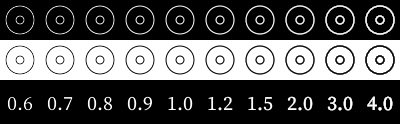

`curve-quality` demonstration:

	format IVG-3 requires:ImpD-1
	bounds 0,0,410,100
	WIPE white
	pen black
	offset 40,40
	for quality in:[0.001,0.01,0.1,1.0,10.0] [
		options curve-quality: $quality
	
		// Draw an SVG path with a high number of curve segments
		PATH svg:[M0,0Q8,0,0,5Q-7,9-10,0Q-14-12,0-15Q17-19,20,0Q24,22,0,25Q-27,28-30,0Q-33-32,0-35Q37-38,40,0]
	
		// Draw a label under the path indicating the current curve quality
		font serif size:20 color:black
		TEXT at:0,50 $quality anchor:center
		offset 80,0
	]

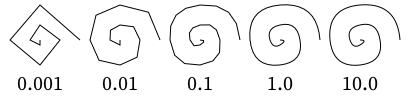

`pattern-resolution` demonstration:

	format IVG-3 requires:ImpD-1
	bounds 0,0,320,100
	
	// Wipe the canvas with a dark grey color.
	WIPE #101010
		
	// Loop through different pattern resolution values.
	x=0
	for resolution in:[1,2,4,8] [
		context [
			// Set the pattern resolution option to the current value.
			options pattern-resolution:$resolution
			
			// Declare the pattern using a simple gradient-colored circle.
			fill pattern:[
				bounds 0,0,10,10
				pen gradient:[linear 0,0,1,1 stops:[0,blue,0.5,yellow,0.8,blue]] relative:yes
				ELLIPSE 5,5,3
			]
			
			// Scale the pattern up by 8x after the pattern definition to
			// showcase the need to set the resolution option higher than 1.
			scale 8
			
			// Draw a rectangle to show the pattern.
			RECT $x,0,10,10
			
			// Write the resolution value under the rectangle.
			font serif color:white size:2
			TEXT at:{$x+5},11 [$resolution x] anchor:center
			
			x={$x+10}
		]
	]
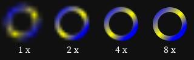

### pen

The `pen` directive sets the style of lines and outlines of shapes. The style settings are used for subsequent drawing
operations until they are changed or the current [context](#context) ends or is [reset](#reset).

Syntax:

	pen [ <paint> ]
		[ width:<number> ]
		[ caps:butt|round|square ]
		[ joints:bevel|curve|miter ]
		[ miter-limit:<number> ]
		[ dash:none | (<dash>[,<gap>]) ]
		[ dash-offset:<number> ]

-	`<paint>` sets the color, gradient, or pattern. See [Paint Specification](#paint-specification).

-	The `width` option sets the width of the stroke in pixels. The initial value is 1.

-	The `caps` option sets the shape at the end of open paths. The possible values are `butt`, `round`, and `square`.
	The initial value is `butt`.

-	The `joints` option sets the shape at the corners of paths. The possible values are `bevel`, `curve`, and `miter`.
	The initial value is `miter`.

-	The `miter-limit` option controls the maximum ratio of the miter length to the stroke width. The initial value is 2,
	and the valid range is greater than or equal to 1.

-	The `dash` option sets the pattern of dashes and gaps used to stroke paths. When specifying `dash` and omitting
	`gap`, the gap will be the same as the dash length. The initial value is `none`.

-	The `dash-offset` option sets the distance into the dash pattern at which the stroke begins.

The initial pen is `none`. In other words, invisible.

Demonstration of different stroke styles:

	format IVG-3 requires:ImpD-1
	bounds 0,0,560,400
	
	// Wipe canvas and setup styles.
	WIPE #F0F0D0
	font code size:16
	pen #202040 width:20 caps:butt joints:miter
	fill none
	
	// $drawPath <x> <y> <pen instruction>
	drawPath = call [
		context [
			path=[M -100,100 L 0,0 L 100,100]
			
			// Draw at <x>,<y>.
			offset $0,$1
			
			// Execute argument 2: <pen instruction> and draw the path.
			$2
			PATH svg:$path
			
			// Draw the path with a thin non-dashed line.
			pen width:1 caps:butt joints:miter #A0A0C0 dash:none
			PATH svg:$path
			
			// Show the three coordinates defining the shape.
			fill #7070C0
			ELLIPSE -100,100,3
			ELLIPSE 0,0,3
			ELLIPSE 100,100,3
			
			// Write out the <pen instruction> but cut out "[pen " and "]".
			TEXT at:0,140 anchor:center [{$2{5:len($2)-6}}]
		]
	]
	
	$drawPath 150 30 [pen caps:square joints:miter]
	$drawPath 400 30 [pen caps:round joints:curve]
	$drawPath 150 230 [pen caps:butt joints:bevel]
	$drawPath 400 230 [pen dash:20,10 dash-offset:4]
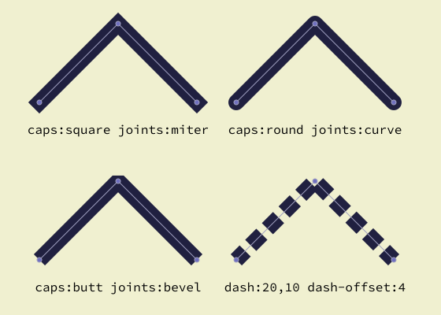

### reset

The `reset` directive is used to clear the current state of the drawing context and set it back to the initial state of
the current context.

Syntax:

	reset

Note that `reset` does not take any arguments or options. It simply resets the state of the context to what it was at
the entry of the context. This operation includes resetting the current [mask](#mask), [pen](#pen), [fill](#fill), and
[font](#font) settings and other options associated with the context.

The reset directive does not affect any previously drawn elements on the canvas.

`reset` can be useful for clearing the current state before starting a new drawing or for resetting the state after
applying a series of transformations or other modifications to the context.

## Specifications

### Color Specification

`<color>` is used in many directives, such as [`pen`](#pen), [`fill`](#fill), and [`font`](#font). The syntax for
specifying a color is as follows:

	<color> = rgb(<r>,<g>,<b>[,<opacity>])
			| hsv(<h>,<s>,<v>[,<opacity>])
			| #<hex><hex><hex>
			| #<hex><hex><hex><hex>
			| none
			| ( aqua|black|blue|fuchsia|gray|green|lime|maroon
				|navy|olive|purple|red|silver|teal|white|yellow )

-	The `rgb` alternative specifies the color using the red, green, and blue components. The values for `<r>`, `<g>`,
	and `<b>` are decimal numbers between 0 and 1, representing the intensity of each component. The optional
	`<opacity>` value is also a decimal number between 0 and 1, where 0 is full transparency, and 1 is full opacity.

-	The `hsv` alternative specifies the color using the hue, saturation, and value components. The values for `<h>`,
	`<s>`, and `<v>` are decimal numbers between 0 and 1, representing the intensity of each component. The optional
	`<opacity>` value is also a decimal number between 0 and 1, where 0 is full transparency and 1 is full opacity

-	The `#<hex><hex><hex>` alternative specifies the color using a hexadecimal RGB value, where each color component is
	between `#00` and `#FF`. This is a common way to specify colors on the web.

-	The `#<hex><hex><hex><hex>` alternative specifies the color using a hexadecimal AARRGGBB value where the RGB values
	must be pre-multiplied with the alpha value: `rgb' = round(rgb * alpha / 255)`. For example, the color yellow
	`#FFFF00` with a transparency of 0.75 (decimal equivalent of `#C0`) becomes `#C0C0C000`. A color `#4080C0` at
	50% (`#80`) becomes `#80204060`.

-	`none` is a special color, meaning that no color will be used; it will be invisible.

-	The last alternative specifies the color using one of the predefined color names.

Colors example:

	format IVG-3 requires:ImpD-1
	bounds 0,0,500,380
	
	// Wipe canvas with a checkerboard pattern and setup styles.
	WIPE pattern:[
		bounds 0,0,20,20
		WIPE #202020
		fill #404040
		RECT 0,0,10,10
		RECT 10,10,20,20
	]
	font code size:16 color:white outline:[black width:2]
	pen white width:1
	
	// Iterate through all named colors and some other examples.
	colorList = [
		aqua,black,blue,fuchsia,
		gray,green,lime,maroon,
		navy,olive,purple,red,
		silver,teal,white,yellow
		#4050A0, #A04050A0, #403020, #50403020,
		"rgb(0.5,0.3,0.7)", "rgb(0.5,0.3,0.7,0.5)",
		"hsv(0.5,0.3,0.7)", "hsv(0.5,0.3,0.7,0.5)"
	]
	x=20; y=20
	for color in:$colorList [
		// Make box size wider for long color examples.
		w={len($color)>10 ? 220 : 100}
	
		// If box doesn't fit, wrap to next line.
		if {$x+$w > 480} [ x=20; y={$y+50} ]
		
		// Draw a filled colored box and write the color inside it.
		fill $color
		RECT $x,$y,$w,40
		TEXT at:{$x+$w/2},{$y+25} anchor:center $color
		
		// Next x
		x={$x+$w+20}
	]
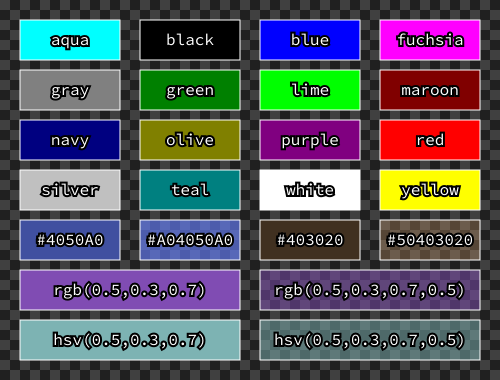

### Gradient Specification

The `<gradient>` paint type creates a smooth transition between multiple colors. It can be specified with a starting and
ending color or multiple color stops. `<gradient>` is used by the [`<paint>`](#paint-specification) specification, such
as in the [`pen`](#pen) and [`fill`](#fill) directives. The syntax for specifying a gradient is as follows:

	<gradient> = (linear <x0>,<y0>,<x1>,<y1> | radial <cx>,<cy>,(<r>|<rx>,<ry>))
				(from:<color> to:<color> | stops:<number>,<color>,[<number>,<color>,...])

-	The `linear` alternative creates a linear gradient that transitions between colors along a straight line defined by
	two points (`<x0>,<y0>` and `<x1>,<y1>`).

-	The `radial` alternative creates a radial gradient that transitions between colors emanating from a single point
	(`<cx>,<cy>`) and spreading outward. You can further define the shape of the gradient by providing either the radius
	(`<r>`), which creates a circular shape or the x-radius and y-radius (`<rx>,<ry>`), which creates an elliptical
	shape.
	
Examples:

	WIPE gradient:[linear 0,0,10,0 from:red to:blue]
	WIPE gradient:[radial 5,5,5 from:white to:black]

-	The `from` alternative specifies the start and end colors of the gradient (see [Color
	Specification](#color-specification)).

-	The `stops` alternative allows you to specify multiple color stops at specific positions along the gradient. The
	`<number>`'s represent positions where 0 is the start or center of the gradient, and 1 is the end. The `<color>'`s
	specify the color at that position (see [Color Specification](#color-specification)). It is important to note that
	you must set the stops in ascending order of the `<number>` positions.

Gradient demonstration:

	format IVG-3 requires:ImpD-1
	bounds 0,0,500,500
	
	// Set font style.
	font serif size:16 color:white
	
	// Wipe the canvas with a simple Linear gradient from red to blue.
	WIPE gradient:[linear 0,0,500,500 from:red to:blue]
	RECT 0,0,500,500
	TEXT at:10,490 anchor:left "linear gradient"
	
	// We will use relative fill. 0,0 is top-left corner. 1,1 is bottom-right.
	fill relative:yes
	
	// Elliptic gradient with stops.
	fill gradient:[radial 0.5,0.5,0.7,0.5 stops:0,blue,0.25,yellow,0.5,blue,0.75,lime,1,blue]
	RECT 200,200,250,250
	TEXT at:210,440 anchor:left "radial gradient with stops"
	
	// Linear gradient with stops.
	fill gradient:[linear 0,0.3,1,0.7 stops:0,red,0.5,lime,1,blue]
	RECT 40,40,250,250
	TEXT at:50,280 anchor:left "linear gradient with stops"
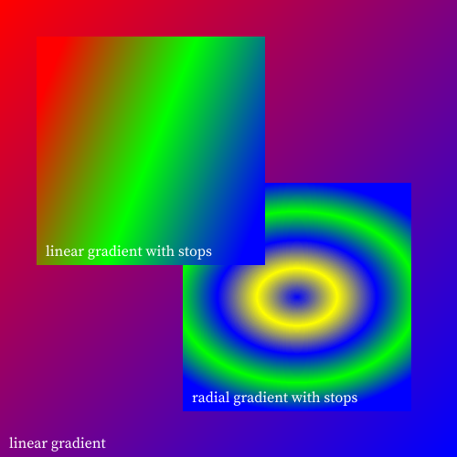

### Paint Specification

`<paint>` is used in many directives, such as [`pen`](#pen), [`fill`](#fill), [`font`](#font), and others. It can be a
solid [`<color>`](#color-specification) specification, a [gradient](#gradient-specification), or a
[pattern](#pattern-specification). The paint specification provides different ways of specifying how the paint should
look like. You can select a solid color, a gradient of colors, or a pattern.

	<paint> = <color> | gradient:<gradient> | pattern:<instructions>
			[ transform:<transform> ]
			[ relative:yes|no ]
			[ opacity:<opacity> ]

-	The `<color>` paint type specifies a solid color using either RGB, HSV, hexadecimal, or name. See [Color
	Specification](#color-specification).

-	The `gradient` paint type specifies a gradient of colors that can be set with a starting and ending color or
	multiple color stops. See [Gradient Specification](#gradient-specification).

-	The `pattern` paint type is used to specify a repeating graphical pattern created from a set of drawing
	instructions. You define the pattern by enclosing the instructions in brackets `[` and `]`. The drawing context
	for the pattern inherits all settings from the current context, such as [`pen`](#pen), [`fill`](#fill), etc.,
	except for the [`mask`](#mask) setting. A [`bounds`](#bounds) directive is required to define the pattern's
	dimensions. The resolution used for rasterizing the pattern can be changed using the [`options`](#options)
	directive.

-	The `transform` option allows you to apply a series of transformations on the paint. These transformations are
	relative to the current transformation of the active [context](#context). See [Transform
	Specification](#transform-specification). (Irrelevant for solid colors.)

-	The `relative` option allows you to specify whether the paint transforms with the objects drawn. If set to `yes`,
	the paint will be transformed along with the objects. If set to `no` it will stay static. (Irrelevant for solid
	colors.)

-	The `opacity` option allows you to specify the opacity of the paint. The value should be between 0 and 1, where 0
	is full transparency and 1 is full opacity. Alternatively, you can use hexadecimal values `#00` to `#FF`.

Demonstration:

	format IVG-3 requires:ImpD-1
	bounds 0,0,400,300
	
	// Light gray background.
	WIPE silver
	
	// Fill the canvas with another (mostly transparent) pattern, opacity:0.6.
	WIPE pattern:[
		bounds 0,0,20,20
		
		// Make a 3D-bevel with black and white paths.
		pen black; PATH svg:[M18.5,2.5h-16v16]
		pen white; PATH svg:[M2.5,18.5h16v-16]
	] opacity:0.6
	
	// Create a mask from a rotated pattern with circles. Scale to 75%.
	mask [
		WIPE pattern:[
			bounds 0,0,100,100
			ELLIPSE 40,45,30
			ELLIPSE 80,80,20
		] transform:[scale 0.75; rotate 10 anchor:200,150]
	]
	
	// Fill the mask with a relative gradient.
	fill gradient:[linear 0,0,1,1 stops:0.0,white,1.0,blue] relative:yes
	RECT 0,0,400,300
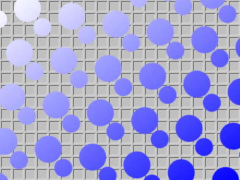

### Transform Specification

`<transform>` instructions modify the drawing instructions' position, shape, or orientation. You use transformations in
two ways:

1.	You can use a transformation as an instruction of its own to transform the current [context](#context) and all
	subsequent drawing operations. The transformation is applied to the entire canvas when used in this way.

2.	Transformations can also appear inside directives such as [`<paint>`](#paint-specification), [`font`](#font), and
[`image`](#image) to transform specific objects. In these cases, you specify the transformation within square brackets
`[` and `]`, and you can list multiple transformations separated with a semicolon `;`. Transformations apply left to
right in the order written.

The syntax for specifying a transformation is as follows:

	<transform> = offset <x>,<y>
				| scale <n>[,<n>]
				| rotate <degrees>
				| shear <x>,<y>
				| matrix <n>,<n>,<n>,<n>,<n>,<n>
				[ anchor:<x>,<y> ]

-	The `offset` alternative moves the context/object by the specified `<x>` and `<y>` amount.

-	The scale `<n>[,<n>]` alternative resizes the context/object by the specified `<n>` factor. You can provide an
	optional second value to specify a different scaling factor for the x and y-axis.

-	The `rotate` alternative rotates the context/object by the specified `<degrees>` amount. `<degrees>` is clockwise positive.

-	The `shear` alternative skews the context/object by the specified `<x>` and `<y>` amount.

-	The `matrix` alternative applies a transformation matrix to the context/object. The six values correspond to an
	SVG-style matrix `[a c e; b d f; 0 0 1]`.

-	You can provide an optional anchor point with any of the above alternatives (except `offset`) by appending `anchor`
	to the transformation. `anchor` will specify a point in the context/object that will be used as the base for the
	transformation. By default, the anchor point is the origin (0,0).

Demonstration:

	format IVG-3 requires:ImpD-1
	bounds 0,0,310,240
	
	WIPE #403020
	fill #C04030 opacity:0.8
	pen #C090C0 width:2
	font serif size:22 color:white
	
	// We start a context here so we can use reset between each transform.
	context [
		// No transform.
		RECT 20,20,80,50
	
		// Simple translation (moving the rectangle)
		offset 60,20
		RECT 20,20,80,50
		TEXT at:25,65 "offset"
		reset
		
		// -10 degrees rotation around an anchor (center of rect).
		offset 180,0
		rotate -10 anchor:60,45
		RECT 20,20,80,50
		TEXT at:25,65 "rotate"
		reset
		
		// Scale X and Y differently (0.7 and 2).
		offset 0,80
		scale 0.7,2
		RECT 20,20,80,50
		TEXT at:25,65 "scale"
		reset
		
		// Shear
		offset 60,100
		shear 0.2,0.3
		RECT 20,20,80,50
		TEXT at:25,65 "shear"
		reset
		
		// Arbitrary transform matrix.
		matrix -0.2,0.8,1.6,0.2,180,120
		RECT 20,20,80,50
		TEXT at:25,65 "matrix"
	]
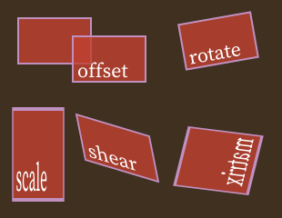

## Defaults

| Setting					 | Initial value					 |
|----------------------------|-----------------------------------|
| pen paint					 | none								 |
| pen width					 | 1								 |
| pen caps					 | butt								 |
| pen joints				 | miter							 |
| pen miter-limit			 | 2								 |
| pen dash					 | none							 |
| fill paint				 | none								 |
| font name					 | (none; must set before `TEXT`)	 |
| font size					 | 20								 |
| font color				 | black							 |
| font outline				 | none								 |
| font tracking				 | 0								 |
| options aa-gamma			 | 1								 |
| options curve-quality		 | 1								 |
| options pattern-resolution | 1								 |
